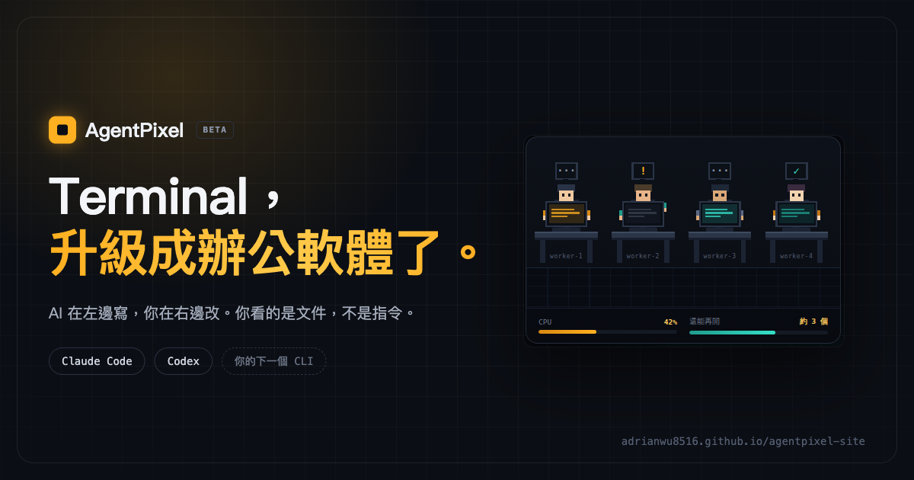

<div align="center">



<br><br>

[](https://github.com/adrianwu8516/agentpixel-site/releases/latest)
[%20%7C%20Windows%20x64-35e0c8)](#下載)
[](https://github.com/adrianwu8516/agentpixel-site/releases)
[](#下載)

**[官方網站](https://adrianwu8516.github.io/agentpixel-site/)** · [简体中文](https://adrianwu8516.github.io/agentpixel-site/cn/) · [English](https://adrianwu8516.github.io/agentpixel-site/en/) · [日本語](https://adrianwu8516.github.io/agentpixel-site/ja/)

</div>

---

## 這是什麼

**Terminal，升級成辦公軟體了。**

AI 在左邊寫，你在右邊改——同一份檔案、同一個時間。你看的是文件，不是指令。我們叫它並肩工作。

Excel、Word、PDF、CSV、Notebook、資料庫……40 多種格式都在 agent 旁邊直接看；表格類的檔案直接改儲存格、存回原檔。

別人給你一個 agent 的對話框，AgentPixel 給你整台終端機——檔案總管、即時預覽、多個 agent 並排、額度儀表，全部在同一個畫面裡。原生 macOS / Windows App，本機優先，資料不離開你的電腦。

支援 **Claude Code** 與 **Codex**。

## 下載

Beta 階段，免費下載。

| 平台 | 檔案 | 需求 |
|---|---|---|
| **macOS** | [`.dmg`](https://github.com/adrianwu8516/agentpixel-site/releases/latest) · 54 MB | Apple Silicon（M 系列）only |
| **Windows** | [`.exe`](https://github.com/adrianwu8516/agentpixel-site/releases/latest) 38 MB · [`.msi`](https://github.com/adrianwu8516/agentpixel-site/releases/latest) 47 MB | Windows 10 1809 或更新 · x64 |

> 所有版本都在 [Releases](https://github.com/adrianwu8516/agentpixel-site/releases) 頁面。

---

## 三個核心

### 01 · AI 寫完了，檔案在哪？

它一次生五份檔案。你不該還要開 Finder 一個一個找，更不該為了改四個字重下一次 prompt。

- **生出來就在左邊** — 新檔案一產出就出現在左側檔案樹，點一下打開。Terminal 與文件並排，單螢幕筆電也做得到。
- **不順眼就自己改** — 一個字一個字看它寫，不必等它跑完。想改就點進去打字，人和 AI 共用同一份檔案。

### 02 · 你的 Agent 們，現在有臉了

誰在忙、誰舉手、誰做完了，一眼看完。順便告訴你，這台電腦還撐得住幾個——CPU、記憶體、還能再開幾個 agent，都在同一排儀表上。

### 03 · 走出門，Agent 還在幫你上班

你去開會，它卡在一個等你點頭的問題上，空轉了十五分鐘。

**Remote** 讓你用手機接手：切分頁、換 CLI、開一個全新的工作，手機上都做得到。卡住了推播給你，點一下就繼續跑——東西還是跑在你自己那台電腦上。

---

## 還有這些

小事，但每天都會遇到。

| | |
|---|---|
| **額度儀表** | 不會寫到一半突然沒額度。五小時與週窗口各剩多少、何時重置，一次看完。Claude 與 Codex 分開算。 |
| **狀態持久化** | 關掉重開，現場還在。分頁佈局、工作目錄、每個 agent 的位置完整還原。當機、重開機、下班關電腦，都接得回來。 |
| **Manager 模式**（Labs） | 逐一設定每個 Session 能自動執行什麼，其餘操作留給你核准。跑得起來了，但最好的用法我們自己也還在找。 |

## 不綁定廠商

今天用 Claude，明天用 Codex，後天用還沒出生的那個。AgentPixel 不在乎你用誰。

## 關於這個 repo

這裡是 AgentPixel 的**官方網站原始碼**（GitHub Pages）與**發行檔下載來源**（Releases）。App 本身的原始碼不在這裡。

```
index.html          繁體中文（預設 / master —— 改文案請改這裡，其餘三個語系由 tools/bake.py 產生）
cn/index.html       简体中文（由 tools/add-cn.py 用 OpenCC 從繁中轉換 + 人工校對術語）
en/index.html       English
ja/index.html       日本語
og*.png             各語系的社群分享預覽圖
```

## 授權

專有授權，保留一切權利 — 詳見 [LICENSE](LICENSE)。

App **可以自由下載使用**（Beta 期間免費，個人與商業用途皆可）。但網站原始碼、文案與品牌素材不得複製轉載，發行檔不得轉散布或重新打包。

---

<details>
<summary><strong>In English</strong></summary>

<br>

**AgentPixel — the best office software is a terminal.**

You give the order, the agent writes the doc, and you watch every word land. Don't like something? Fix it yourself.

Instead of one more chat box, AgentPixel gives you the whole terminal: a live file tree, side-by-side document preview, several agents running in parallel with visible status, and a quota dashboard — in a single native window. Local-first; your files never leave your machine. Works with **Claude Code** and **Codex**, and isn't tied to either.

- **Files show up as they're written** — click to open, edit while the agent is still typing. Same file, both of you.
- **Your agents have faces** — see who's busy, who's blocked, who's done, and how many more your machine can take.
- **Remote** — pick up from your phone. Switch tabs, swap CLIs, start new work; get a push when an agent needs your approval. The work still runs on your own computer.

Free during beta — [download for macOS or Windows](https://github.com/adrianwu8516/agentpixel-site/releases/latest) · [website](https://adrianwu8516.github.io/agentpixel-site/en/)

Proprietary, all rights reserved — see [LICENSE](LICENSE). The app is free to download and use during beta; the website source, copy, and brand assets are not licensed for reuse.

</details>

<div align="center"><sub>© 2026 AgentPixel</sub></div>
